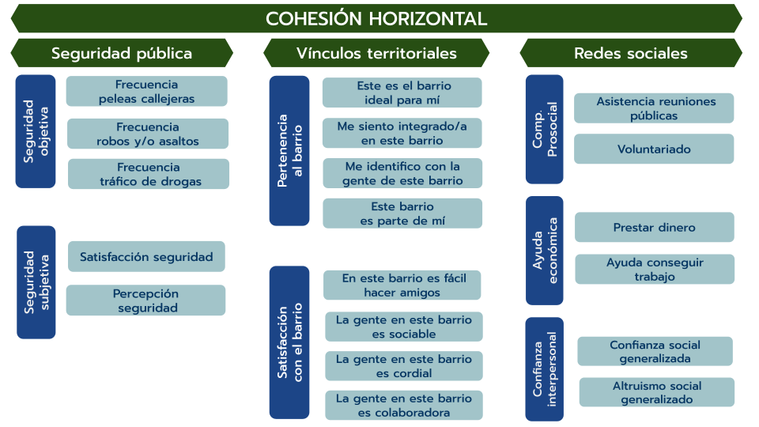
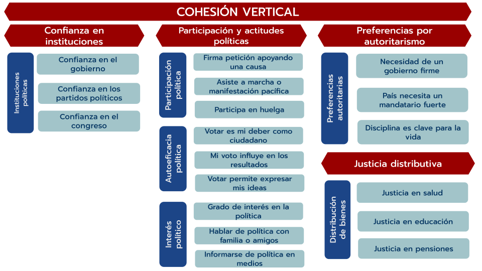

```{r}
#| context: setup
#| include: false

## Cargar librerías
library(tidyverse)
library(sf)
#library(leaflet)
library(plotly)
library(shinyjs)
library(shinyWidgets)
library(shinyEffects)
library(shinydashboardPlus)
library(shinydashboard)
library(ggrepel)
library(cowplot)
#library(magick)
#library(highcharter)
library(fontawesome)
library(scales)
library(ggthemes)
library(RColorBrewer)
# library(hrbrthemes)
library(sjlabelled)
library(V8)
# library(Cairo)
library(shinythemes)
library(htmltools)
options(shiny.usecairo = TRUE)

shinyWidgets:::html_dependency_picker_bs(
  theme = bslib::bs_theme(version = 5)
)

load("data/bases-vis-elsoc/bivariados_long_categoricos.RData")

# función para generar las columnas "category" y "levels" en cada base 
standardize_long <- function(df, level_col, category_name) {
  df %>% filter(categoria=="Alto") %>%
    # mantener solo las columnas comunes + la columna de niveles
    select(subdimension, dimension, prop, ola, area, {{ level_col }}) %>%
    # renombrar a 'levels' y agregar 'category'
    rename(levels = {{ level_col }}) %>%
    mutate(
      category = category_name,
      # opcional: normalizar tipos / trims
      levels = as.character(levels),
      category = as.character(category)
    ) %>%
    # reordenar columnas
    arrange(ola, category, levels, subdimension, dimension, prop)
}

# se aplica la función a las bases que contiene las variables demográficas de interés
genero <- standardize_long(sexo_categ, sexo, "Sexo")
educacion <- standardize_long(cine_categ, cine, "Educación")
ingresos <- standardize_long(ingreso_categ, grupo_ingreso, "Ingresos")
edad <- standardize_long(edad_categ, edad_t, "Edad")
id_pol <- standardize_long(ideologia_categ, ideologia, "Ideología política")

# se unen las bases de datos para generar la bbdd que contiene todos los cruces
df_long_bivariate <- bind_rows(genero, educacion, ingresos, edad, id_pol)

# procesamiento idéntico a la basee longitudinal

df_long_bivariate <- df_long_bivariate %>%
  mutate(
    dimension = if_else(
      is.na(dimension) & subdimension == "Justicia distributiva",
      "Justicia distributiva",  # o el nombre que corresponda
      dimension
    )
  )

df_long_bivariate <- df_long_bivariate %>%
  filter(!is.na(dimension))

# pasar valores a %
# df_long_bivariate <- df_long_bivariate %>% dplyr::mutate(Valor = prop * 100)

# seleccionar, renombrar y ordenar columnas

df_long_bivariate <- df_long_bivariate %>%
  select(ola, subdimension, dimension, area, prop, category, levels) %>%
  rename(Ola=ola,Areas=area,Subdimension=subdimension,Dimension=dimension, Valor=prop, Categoria = category) %>%
  arrange(Ola, Categoria, levels, Subdimension, Dimension, Areas, Valor)

# base ranking
load("data/bases-vis-elsoc/df_categ_jerarquica_ranking.RData")
# ola, indicador, subdimension (esto en el selector)
# if selector subdimension--> plot indicadores
df_long <- df_categ_jerarquica_ranking %>% dplyr::filter(valor=="Alto")
```

```{=HTML}
<div class="logo-bloque">
  <a href="https://ocs-coes.com/" target="_blank">
    
  </a>
</div>

<style>
.centered-img {
  display: block;
  margin-left: auto;
  margin-right: auto;
}

.logo-bloque {
  margin-top: 10px;
  margin-bottom: 25px;
}
</style>
```

# Inicio

**¡Bienvenido al Visualizador Longitudinal de Cohesión Social en Chile!**

Todos los gráficos fueron construidos a partir de los datos del **Estudio Longitudinal Social de Chile (ELSOC), COES**. Para ello, se han considerado a los individuos que han participado a lo menos en 3 olas del estudio. Para más información, consulte [aquí](https://conferencias.coes.cl/encuesta-panel/). 

Para usar alguna de las figuras, citar como: **Urzúa, T., Iturra, J., Canales, R., Laffert, A. & Castillo, J. (2025). _Visualizador Longitudinal de Cohesión Social de Chile 2016-2023_.**

**Instrucciones generales**:


  -   **_Longitudinal_**: En este apartado se comparan los promedios de las dimensiones y subdimensiones a través de un gráfico de líneas histórico. Para proyectar los análisis, debes seleccionar un elemento a visualizar.
  
  -   **_Ranking_**: Sigue la misma lógica que la sección anterior, pero aquí se comparan los cambios a través del tiempo de los indicadores que componen las subdimensiones.

  -   **_Bivariado_**: Aquí se pueden cruzar subdimensiones de cohesión social con variables sociodemográficas, observando cómo se han comportado distintos grupos sociales durante los años.

Todos los indicadores, subdimensiones y dimensiones fueron construidos a partir de índices promediados.
  
Más información sobre la selección de variables, validación de los datos y construcción de los índices la puedes encontrar en el [**Documento Metodológico**](https://ocscoes.github.io/propuesta-medicion-elsoc/output/book-cohesion-elsoc/docs/index.html) (esquina superior derecha). 


Los **indicadores de cohesión social** disponibles en el visualizador son los que se presentan en **los siguientes esquemas**: 

<p align="center">
  
</p>

<p align="center">
  
</p>

# Análisis Longitudinal


## {.sidebar width="20%"}

```{r}


tagList(
 fluidRow(
   column(
     6,
     selectizeInput(
       "subdims_from_area_v",
       tags$span("Cohesión vertical:", style = "font-weight:bold; font-size:18px;"),
       choices = NULL,
       multiple = TRUE,
       options = list(
         placeholder = "Elige subdimensiones",
         maxItems = 6,
         plugins = list("remove_button"),
         onInitialize = I('
           function() {
             var self = this;
             this.$control.on("mousedown", ".item", function(e){
               var value = $(this).attr("data-value");
               if (!value) return;
               self.removeItem(value, false);
               e.preventDefault();
               e.stopImmediatePropagation();
               return false;
             });
           }
         ')
       )
     )
   ),
   column(
     6,
     selectizeInput(
       "subdims_from_area_h",
       tags$span("Cohesión horizontal:", style = "font-weight:bold; font-size:18px;"),
       choices = NULL,
       multiple = TRUE,
       options = list(
         placeholder = "Elige subdimensiones",
         maxItems = 7,
         plugins = list("remove_button"),
         onInitialize = I('
           function() {
             var self = this;
             this.$control.on("mousedown", ".item", function(e){
               var value = $(this).attr("data-value");
               if (!value) return;
               self.removeItem(value, false);
               e.preventDefault();
               e.stopImmediatePropagation();
               return false;
             });
           }
         ')
       )
     )
   )
 )
)


```


```{r}
uiOutput("descripcion_longitudinal")
```


## Gráfico


```{r}
# plotlyOutput("longitudinal_plotly", height = "800px")
plotlyOutput("subdims_plot", height = "800px")
```


# Ranking

## {.sidebar width="25%"}

```{r barras-ui-selector}
shiny::selectInput(
  inputId = "area_ranking",
  label = "Elige un Área:",
  choices = sort(unique(df_long$area)),
  selected = "Area horizontal"
  )

shiny::selectInput(inputId ="subdim_ranking",label = "Selecciona una subdimensión",
    choices = sort(unique(df_long$subdimension)),
    selected = "Ayuda económica"
    )

shiny::checkboxGroupInput(
  inputId = "ola_ranking",
  label = "Selecciona los años:",
  choices = unique(df_long$ola),
  selected = unique(df_long$ola)[1:length(unique(df_long$ola))],
  inline = TRUE
  )
```

```{r barras-ui-render}
uiOutput("descripcion_barras")
```

## Grafico ranking

```{r barras-plot-output}
plotlyOutput("bar_plot")
```

# Análisis Bivariado

## {.sidebar width="20%"}

```{r}

tags$style(HTML("
  .styled-slider .irs-bar { background: transparent !important; }
  .styled-slider .irs-handle {
    background: #497abd !important;
    border: 1px solid #1c7bbf !important;
    width: 20px; height: 20px;
    clip-path: polygon(0% 0%, 100% 0%, 50% 100%);
    border: none;
  }
"))

sidebarPanel(
  # NUEVO selector de área 
  selectInput(
    inputId = "area_select",
    label   = "Elige un área de cohesión:",
    choices = sort(unique(df_long_bivariate$Areas)),
    selected = sort(unique(df_long_bivariate$Areas))[1]
  ),

  # (sin cambios) subdimensión: se actualizará dinámicamente según "area_select"
  selectInput(
    inputId = "subdim_select",
    label   = "Elige una subdimensión:",
    choices = sort(unique(df_long_bivariate$Subdimension)),
    selected = sort(unique(df_long_bivariate$Subdimension))[1]
  ),

  # (sin cambios) categoría
  selectInput(
    inputId = "Categoria_select",
    label   = "Elige una categoría:",
    choices = sort(unique(df_long_bivariate$Categoria)),
    selected = sort(unique(df_long_bivariate$Categoria))[1]
  )
)
```

```{r}
uiOutput("descripcion_bivariado")
```

## Gráfico

```{r}
plotlyOutput("plot_bivariado", height = "800px")
```


```{r server}
#| context: server

# base longitudinal


# load("data/bases-vis-elsoc/df_long_jerarquica.RData")
load("data/bases-vis-elsoc/df_categ_jerarquica.RData")


df_comb <- df_categ_jerarquica %>%
 filter(valor=="Alto") %>%
 mutate(
   dimension = if_else(
     is.na(dimension) & subdimension == "Justicia distributiva",
     "Justicia distributiva",  # o el nombre que corresponda
     dimension
   )
 )


df_comb <- df_comb %>%
 filter(!is.na(dimension))


# pasar valores a %
df_comb <- df_comb %>% dplyr::mutate(Valor = prop * 100)


# seleccionar, renombrar y ordenar columnas


df_comb <- df_comb %>%
 select(ola, subdimension, dimension, area, Valor) %>%
 rename(Ola=ola,Areas=area,Subdimension=subdimension,Dimension=dimension) %>%
 arrange(Ola, Subdimension, Dimension, Areas, Valor)


# --- LONGITUDINAL ----


# 3) Plot: SOLO subdimensiones (líneas por subdimensión) usando 'Ola'


# Paleta fija posicional 
my_colors_long <- c(
  "Confianza en instituciones políticas" = "#99000D",
  "Justicia distributiva" = "#4d5f0b",
  "Autoeficacia política" = "#fFD900",
  "Interés en política" = "#006D77",
  "Participación política" = "#08519C",
  "Preferencias autoritarias" = "#3F007D",
  "Ayuda económica" = "#006D2C",
  "Comportamiento prosocial" = "#333333",
  "Confianza interpersonal" = "#745A07",
  "Seguridad objetiva" = "#7A0177",
  "Seguridad subjetiva" = "#F768A1",
  "Pertenencia al Barrio" = "#FD8D3C",
  "Satisfacción con el barrio" = "#662fe6")


no_real_choice <- function(x) is.null(x) || length(x) == 0


# Evita el patrón "a:b" con vectores (usa seq_len)
safe_slice <- function(n, max_n) seq_len(min(length(n), max_n))


# --- Optgroups: lista "Dimensión" = c(subdims,...) con NA agrupadas ---
make_grouped_choices <- function(df, na_group = "Dimensiones") {
 df %>%
   dplyr::distinct(Dimension, Subdimension) %>%
   dplyr::filter(!is.na(Subdimension)) %>%
   dplyr::mutate(
     Dimension = if (is.factor(Dimension)) {
       forcats::fct_na_value_to_level(Dimension, level = na_group)
     } else {
       tidyr::replace_na(Dimension, na_group)
     },
     Dimension    = as.character(Dimension),
     Subdimension = as.character(Subdimension)
   ) %>%
   dplyr::arrange(Dimension, Subdimension) %>%
   { split(.$Subdimension, .$Dimension) }
}


# --- Paleta global por asignación ---

build_color_map <- function(sel_v, sel_h) {
  sel_v  <- if (is.null(sel_v)) character(0) else sel_v
  sel_h  <- if (is.null(sel_h)) character(0) else sel_h
  sel_all <- unique(c(sel_v, sel_h))
  if (length(sel_all) == 0) return(setNames(character(0), character(0)))

  # 1) Usa colores definidos en la paleta por NOMBRE (no posicional)
  in_palette <- intersect(names(my_colors_long), sel_all)
  cmap <- my_colors_long[in_palette]        # named vector: nombre -> hex

  # 2) Fallback ESTABLE para nombres no contemplados en la paleta
  missing <- setdiff(sel_all, names(cmap))
  if (length(missing) > 0) {
    name2hex <- function(s) {
      # hash simple y determinista a 0..359
      h <- sum(utf8ToInt(s)) %% 360
      grDevices::hcl(h = h, c = 60, l = 45)
    }
    fb <- vapply(missing, name2hex, FUN.VALUE = character(1))
    cmap <- c(cmap, setNames(fb, missing))
  }

  cmap
}


# --- Añade trazas de un área usando df_comb ---

add_area_traces <- function(p, selected_subdims, area_label, line_dash, color_map,
                            connectgaps = TRUE, showlegend_for = character(0)) {
  if (no_real_choice(selected_subdims)) return(p)

  keep <- intersect(selected_subdims, names(color_map))
  if (length(keep) == 0) return(p)

  all_olas <- df_comb %>%
    dplyr::filter(Areas == area_label) %>%
    dplyr::distinct(Ola) %>%
    dplyr::arrange(Ola) %>%
    dplyr::pull(Ola)

  dplot <- df_comb %>%
    dplyr::filter(Areas == area_label, Subdimension %in% keep) %>%
    dplyr::group_by(Ola, Subdimension) %>%
    dplyr::summarise(Valor = mean(Valor, na.rm = TRUE), .groups = "drop") %>%
    dplyr::arrange(Ola)

  if (nrow(dplot) == 0) return(p)

  for (sd in keep) {
    df_i <- dplyr::filter(dplot, Subdimension == sd) %>%
      tidyr::complete(Ola = all_olas, fill = list(Valor = NA_real_)) %>%
      dplyr::arrange(Ola)

    p <- p %>% plotly::add_trace(
      data  = df_i,
      x     = ~Ola, y = ~Valor,
      type  = "scatter", mode = "lines+markers",
      name  = sd,                      # ← solo subdimensión
      legendgroup = sd,                # ← agrupa vertical/horizontal
      showlegend = sd %in% showlegend_for,   # ← leyenda solo si corresponde
      line   = list(width = 3, color = unname(color_map[[sd]]), dash = line_dash),
      marker = list(size = 8, color = unname(color_map[[sd]])),
      connectgaps = connectgaps,
      hovertemplate = paste0(
        "<b>Ola:</b> %{x}",
        "<br><b>Área:</b> ", area_label,
        "<br><b>Subdimensión:</b> ", sd,
        "<br><b>Valor:</b> %{y:.2f}<extra></extra>"
      )
    )
  }
  p
}


# --- SELECTORES (solo df_comb) ---
observe({
 choices_v <- df_comb %>%
   dplyr::filter(Areas == "Area vertical") %>%
   dplyr::select(Dimension, Subdimension) %>%
   make_grouped_choices(na_group = "Dimensiones")


 updateSelectizeInput(session, "subdims_from_area_v",
                      choices = choices_v, selected = NULL)
})


observe({
 choices_h <- df_comb %>%
   dplyr::filter(Areas == "Area horizontal") %>%
   dplyr::select(Dimension, Subdimension) %>%
   make_grouped_choices(na_group = "Dimensiones")


 updateSelectizeInput(session, "subdims_from_area_h",
                      choices = choices_h, selected = NULL)
})


# --- DEFINICIONES DE VARIABLES DE SELECTORES ----
definiciones <- c(
 "Seguridad pública" = "Incluye indicadores tanto objetivos como subjetivos que miden el nivel de seguridad de los individuos.",
"Confianza en instituciones" = "Considera el grado de confianza que tienen los sujetos hacia las instituciones de orden político de la sociedad, tales como el Gobierno, el Congreso y los partidos políticos.",
"Vínculos territoriales" = "Mide el sentido de pertenencia y la satisfacción de los individuos con su barrio de residencia.",
"Redes sociales" = "Aborda las interacciones que evidencian la fortaleza y/o debilidad del vínculo social, tal como el nivel de confianza interpersonal o la asistencia a reuniones públicas",
"Participación y actitudes políticas" = "Mide la participación en actividades de índole política y el interés hacia ella.",
"Preferencias por autoritarismo" = "El acuerdo respecto a ideales autoritarios, como la preferencia por gobiernos firmes, mandatarios fuertes y la obediencia como valor clave.",
"Justicia distributiva" = "La percepción sobre qué tan injusto es el reparto de recursos y oportunidades en la sociedad, considerando salud, educación y pensiones.",
# --- Subdimensiones (las que efectivamente aparecen en los selectores) ---
"Preferencias autoritarias" = "El acuerdo respecto a ideales autoritarios, como la preferencia por gobiernos firmes, mandatarios fuertes y la obediencia como valor clave.",
"Participación política" = "Participación en actividades políticas como firmar peticiones, asistir a marchas o participar en huelgas.",
"Autoeficacia política" = "La percepción sobre la capacidad personal de influir en el proceso político a través del voto.",
"Interés en política" = "El nivel de interés, conversación e información sobre temas políticos.",
"Confianza en instituciones políticas" = "Considera el grado de confianza que tienen los sujetos hacia las instituciones de orden político de la sociedad, tales como el Gobierno, el Congreso y los partidos políticos.",
"Seguridad objetiva" = "Medidas objetivas de criminalidad como frecuencia de peleas callejeras, robos y asaltos en el barrio.",
"Seguridad subjetiva" = "Percepción personal sobre la seguridad y el grado de satisfacción con las medidas de seguridad.",
"Pertenencia al Barrio" = "El grado de identificación e integración con el barrio de residencia.",
"Satisfacción con el barrio" = "Evaluación de las características sociales del barrio (amigable, sociable, cordial, colaborador).",
"Confianza interpersonal" = "El nivel de confianza hacia otras personas y el acuerdo en que los demás actúan de manera altruista.",
"Comportamiento prosocial" = "Participación en actividades comunitarias como reuniones públicas y la participación en voluntariado.",
"Ayuda económica" = "Disposición a prestar dinero y ayudar a conseguir trabajo a un conocido.",
"Sexo" = "Se distingue entre hombre y mujer.",
"Edad" = "Está medida por tramos etarios",
"Ingresos" = "Se mide por tres grupos que tienen una representación aproximada a los ingresos de clase baja, clase media y clase alta.",
"Educación" = "Considera cinco niveles educativos",
"Ideología política" = "Se comprende en el espectro político desde izquierda hasta derecha"

)


# --- Estado previo y última selección (compartido entre ambos selectores) ---
prev_sel <- reactiveValues(v = character(0), h = character(0))
last_selected <- reactiveVal(NULL)


# Cuando cambia el selector VERTICAL
observeEvent(input$subdims_from_area_v, {
 cur  <- input$subdims_from_area_v %||% character(0)
 prev <- prev_sel$v


 added   <- setdiff(cur, prev)     # ítems agregados
 removed <- setdiff(prev, cur)     # ítems eliminados


 if (length(added) > 0) {
   # Si se agregó algo, lo recién agregado es la última selección
   last_selected(added[[1]])
 } else if (length(removed) > 0) {
   # Si se eliminó, toma el último que quedó en este selector (si queda alguno)
   if (length(cur) > 0) {
     last_selected(tail(cur, 1))
   } else {
     # Si este selector quedó vacío, verificar si el otro también está vacío
     other_cur <- input$subdims_from_area_h %||% character(0)
     if (length(other_cur) == 0) {
       # Ambos selectores vacíos: limpiar la descripción
       last_selected(NULL)
     } else {
       # El otro selector aún tiene valores: mantener su última selección
       last_selected(tail(other_cur, 1))
     }
   }
 }
 prev_sel$v <- cur
}, ignoreInit = TRUE, priority = 10)


# Cuando cambia el selector HORIZONTAL
observeEvent(input$subdims_from_area_h, {
 cur  <- input$subdims_from_area_h %||% character(0)
 prev <- prev_sel$h


 added   <- setdiff(cur, prev)
 removed <- setdiff(prev, cur)


 if (length(added) > 0) {
   last_selected(added[[1]])
 } else if (length(removed) > 0) {
   if (length(cur) > 0) {
     last_selected(tail(cur, 1))
   } else {
     # Si este selector quedó vacío, verificar si el otro también está vacío
     other_cur <- input$subdims_from_area_v %||% character(0)
     if (length(other_cur) == 0) {
       # Ambos selectores vacíos: limpiar la descripción
       last_selected(NULL)
     } else {
       # El otro selector aún tiene valores: mantener su última selección
       last_selected(tail(other_cur, 1))
     }
   }
 }
 prev_sel$h <- cur
}, ignoreInit = TRUE, priority = 10)


# --- Render de la descripción ---
output$descripcion_longitudinal <- renderUI({
 sel_v <- input$subdims_from_area_v %||% character(0)
 sel_h <- input$subdims_from_area_h %||% character(0)


 # Si no hay ninguna variable seleccionada en ningún selector, no mostrar nada
 if (length(sel_v) == 0 && length(sel_h) == 0) {
   return(NULL)
 }


 # Orden combinado: primero las del selector vertical, luego las del horizontal (sin duplicar)
 sel_all <- unique(c(sel_v, sel_h))


 # Construimos una "tarjeta" por cada selección
 cards <- lapply(sel_all, function(nm) {
   desc <- definiciones[[nm]]
   if (is.null(desc) || is.na(desc) || identical(desc, "")) {
     desc <- "No tengo una descripción asociada a esta subdimensión todavía."
   }


   tags$div(
     style = "margin-top:8px; padding:10px; border-left:4px solid #1f77b4; background:#f7f7f7; border-radius:6px;",
     tags$strong(nm),
     tags$p(style = "margin:6px 0 0 0;", desc)
   )
 })


 # Devolvemos todas las tarjetas apiladas
 tagList(cards)
})


# --- RENDER DEL GRÁFICO ---
output$subdims_plot <- plotly::renderPlotly({
  sel_v <- input$subdims_from_area_v
  sel_h <- input$subdims_from_area_h

  if (no_real_choice(sel_v) && no_real_choice(sel_h)) {
    return(
      plotly::plot_ly() %>%
        plotly::layout(
          xaxis = list(title = "", showgrid = FALSE, zeroline = FALSE, showticklabels = FALSE),
          yaxis = list(title = "", showgrid = FALSE, zeroline = FALSE, showticklabels = FALSE),
          showlegend = FALSE,
          paper_bgcolor = "rgba(0,0,0,0)",
          plot_bgcolor = "rgba(0,0,0,0)"
        )
    )
  }

 # 3) Colores consistentes
color_map <- build_color_map(sel_v, sel_h)

# 4) Define quién “abre” leyenda
show_v <- sel_v
show_h <- setdiff(sel_h, sel_v)

p <- plotly::plot_ly()
p <- add_area_traces(
  p, sel_v, "Area vertical",
  line_dash = "dot", color_map = color_map, connectgaps = TRUE,
  showlegend_for = show_v           # ← todas las V con leyenda
)
p <- add_area_traces(
  p, sel_h, "Area horizontal",
  line_dash = "dash", color_map = color_map, connectgaps = TRUE,
  showlegend_for = show_h           # ← solo H que no estén en V
)

 # 5) Layout final
 p %>%
  plotly::layout(
    title  = "Serie temporal para categoría 'Alta' - 2016 a 2023",
    xaxis  = list(title = "Ola", dtick = 1),
    yaxis  = list(title = "Porcentaje", range = c(0, 100), ticksuffix = "%"),
    showlegend = TRUE,
    legend = list(
      orientation = "v",
      xanchor = "right",
      yanchor = "bottom",
      x = 1.02,
      y = -0.40,
      bgcolor = "rgba(255,255,255,0.8)",
      bordercolor = "gray70",
      borderwidth = 0.5,
      font = list(size = 12),
      tracegroupgap = 2,
      itemwidth = 30
    ),
    images = list(
      list(
        source = "www/images/logo-ocs-25.png",
        xref = "paper",
        yref = "paper",
        x = 1.1,
        y = 1,
        sizex = 0.25,
        sizey = 0.2,
        xanchor = "right",
        yanchor = "top",
        layer = "above"
      )
    ),
    annotations = list(
      list(
        text = "Fuente: Encuesta Longitudinal Social de Chile (ELSOC), COES. N = 3666 (individuos)",
        xref = "paper",
        yref = "paper",
        x = 0,
        y = -0.18,
        xanchor = "left",
        yanchor = "top",
        align = "left",
        showarrow = FALSE,
        font = list(size = 12, color = "gray40")
      ),
      list(
        text = "Los puntos ausentes en las olas significan que no hay datos disponibles para ese año.",
        xref = "paper",
        yref = "paper",
        x = 0,
        y = -0.24,
        xanchor = "left",
        yanchor = "top",
        align = "left",
        showarrow = FALSE,
        font = list(size = 12, color = "gray40")
      ),
      list(
        text = "Líneas con puntos = Cohesión vertical; Líneas con guiones = Cohesión horizontal.",
        xref = "paper",
        yref = "paper",
        x = 0,
        y = -0.30,
        xanchor = "left",
        yanchor = "top",
        align = "left",
        showarrow = FALSE,
        font = list(size = 12, color = "gray40")
      )
    ),
    margin = list(b = 150, r = 120)
  ) %>%
  plotly::config(
    displaylogo = TRUE,
    toImageButtonOptions = list(
      format = "png",
      filename = paste0(
        "serie_temporal_",
        stringi::stri_replace_all_regex(
          tolower(input$subdim_select),
          "[^A-Za-z0-9]",
          "_"
        )
      ),
      height = 700,
      width = 1200,
      scale = 2
    ),
    modeBarButtonsToRemove = c("zoom2d", "select2d", "lasso2d", "autoScale2d",
                               "resetScale2d", "toggleSpikelines")
  )
 })

# ---- RANKING ----


# ----BIVARIADO ----

load("data/bases-vis-elsoc/bivariados_long_categoricos.RData")

# función para generar las columnas "category" y "levels" en cada base 
standardize_long <- function(df, level_col, category_name) {
  df %>% filter(categoria=="Alto") %>%
    # mantener solo las columnas comunes + la columna de niveles
    select(subdimension, dimension, prop, ola, area, {{ level_col }}) %>%
    # renombrar a 'levels' y agregar 'category'
    rename(levels = {{ level_col }}) %>%
    mutate(
      category = category_name,
      # opcional: normalizar tipos / trims
      levels = as.character(levels),
      category = as.character(category)
    ) %>%
    # reordenar columnas
    arrange(ola, category, levels, subdimension, dimension, prop)
}

# se aplica la función a las bases que contiene las variables demográficas de interés
genero <- standardize_long(sexo_categ, sexo, "Sexo")
educacion <- standardize_long(cine_categ, cine, "Educación")
ingresos <- standardize_long(ingreso_categ, grupo_ingreso, "Ingresos")
edad <- standardize_long(edad_categ, edad_t, "Edad")
id_pol <- standardize_long(ideologia_categ, ideologia, "Ideología política")

# se unen las bases de datos para generar la bbdd que contiene todos los cruces
df_long_bivariate <- bind_rows(genero, educacion, ingresos, edad, id_pol)

# procesamiento idéntico a la base longitudinal

df_long_bivariate <- df_long_bivariate %>%
  mutate(
    dimension = if_else(
      is.na(dimension) & subdimension == "Justicia distributiva",
      "Justicia distributiva",  # o el nombre que corresponda
      dimension
    )
  )

df_long_bivariate <- df_long_bivariate %>%
  filter(!is.na(dimension))

# seleccionar, renombrar y ordenar columnas

df_long_bivariate <- df_long_bivariate %>%
  select(ola, subdimension, dimension, area, prop, category, levels) %>%
  rename(Ola=ola,Areas=area,Subdimension=subdimension,Dimension=dimension, Valor=prop, Categoria = category) %>%
  arrange(Ola, Categoria, levels, Subdimension, Dimension, Areas, Valor)

  # pasar valores a %
 df_long_bivariate <- df_long_bivariate %>% dplyr::mutate(Valor = Valor * 100)

# ---- Selector ----

# Subdimensiones disponibles según área seleccionada
subdims_by_area <- reactive({
  req(input$area_select)
  df_long_bivariate %>%
    dplyr::filter(Areas == input$area_select) %>%
    dplyr::distinct(Subdimension) %>%
    dplyr::pull(Subdimension) %>%
    sort()
})

# Actualiza dinámicamente el select de subdimensiones al cambiar el área
observeEvent(input$area_select, {
  # intentamos mantener la selección si sigue siendo válida
  sel_actual <- isolate(input$subdim_select)
  opciones   <- subdims_by_area()
  sel_nueva  <- if (!is.null(sel_actual) && sel_actual %in% opciones) sel_actual else dplyr::first(opciones)

  updateSelectInput(
    inputId = "subdim_select",
    choices = opciones,
    selected = sel_nueva
  )
}, ignoreInit = FALSE)

# ---- tarjetas de definiciones ----

output$descripcion_bivariado <- renderUI({
  subd <- input$subdim_select
  catg <- input$Categoria_select

  # Si no hay nada seleccionado, no mostramos nada
  if (is.null(subd) && is.null(catg)) return(NULL)

  make_card <- function(titulo, clave_busqueda) {
    desc <- definiciones[[clave_busqueda]]
    if (is.null(desc) || is.na(desc) || identical(desc, "")) {
      desc <- "No tengo una descripción asociada todavía."
    }
    tags$div(
      style = "margin-top:8px; padding:10px; border-left:4px solid #1f77b4; background:#f7f7f7; border-radius:6px;",
      tags$strong(titulo),
      tags$p(style = "margin:6px 0 0 0;", desc)
    )
  }

  # Construimos tarjetas (una por subdimensión y otra por categoría, si existen)
  tagList(
    if (!is.null(subd)) make_card(subd, subd),
    if (!is.null(catg)) make_card(paste0("Categoría: ", catg), catg)
  )
})

# ---- RENDER PLOT ----

dat_filtered <- reactive({
  req(input$area_select, input$subdim_select, input$Categoria_select)

  df_long_bivariate %>%
    dplyr::ungroup() %>%
    dplyr::filter(
      Areas       == input$area_select,
      Subdimension == input$subdim_select,
      Categoria    == input$Categoria_select
    ) %>%
    dplyr::select(Ola, levels, Valor, Subdimension, Categoria, Areas) %>%
    dplyr::mutate(
      Ola    = as.factor(Ola),
      levels = as.factor(levels)
    ) %>%
    dplyr::arrange(Ola, levels)
})

output$plot_bivariado <- plotly::renderPlotly({
  req(dat_filtered())
  
  df_plot <- dat_filtered()

  plotly::plot_ly(
    df_plot,
    x = ~Ola,
    y = ~Valor,
    color = ~levels,
    type = "scatter",
    mode = "lines+markers",
    line = list(width = 2),
    marker = list(size = 6),
    connectgaps = TRUE,
    hovertemplate = ~paste0(
      "<b>Ola:</b> ", Ola,
      "<br><b>Área:</b> ", Areas,
      "<br><b>Subdimensión:</b> ", Subdimension,
      "<br><b>Categoría:</b> ", Categoria,
      "<br><b>Nivel:</b> ", levels,
      "<br><b>Valor:</b> ", sprintf("%.2f", Valor), "%",
      "<extra></extra>"
    )
  ) %>%
    plotly::layout(
      title = "Serie temporal para categoría 'Alta' (2016 a 2023)",
      xaxis = list(title = "Ola"),
      yaxis = list(title = "Porcentaje", ticksuffix = "%"),
      legend = list(
        orientation = "v",
        xanchor = "right",
        yanchor = "bottom",
        x = 1,
        y = -0.40,
        bgcolor = "rgba(255,255,255,0.8)",
        bordercolor = "gray70",
        borderwidth = 0.5,
        font = list(size = 12),
        tracegroupgap = 2,
        itemwidth = 30
      ),
      margin = list(r = 120, b = 120),
      images = list(
        list(
          source = "www/images/logo-ocs-25.png",
          xref = "paper", 
          yref = "paper",
          x = 1.1, 
          y = 1,
          sizex = 0.25, 
          sizey = 0.2,
          xanchor = "right", 
          yanchor = "top",
          layer = "above"
        )
      ),
      annotations = list(
        list(
          text = "Fuente: Encuesta Longitudinal Social de Chile (ELSOC), COES. N = 3666 (individuos)",
          xref = "paper", 
          yref = "paper",
          x = 0, 
          y = -0.22,
          xanchor = "left", 
          yanchor = "top",
          align = "left",
          showarrow = FALSE,
          font = list(size = 12, color = "gray40")
        )
      )
    ) %>%
    plotly::config(
      displaylogo = TRUE,
      toImageButtonOptions = list(
        format = "png",
        filename = paste0(
          "serie_temporal_",
          stringi::stri_replace_all_regex(
            tolower(input$subdim_select), 
            "[^A-Za-z0-9]", 
            "_"
          )
        ),
        height = 700,
        width = 1200,
        scale = 2
      ),
      modeBarButtonsToRemove = c("zoom2d", "select2d", "lasso2d", "autoScale2d",
                                 "resetScale2d", "toggleSpikelines")
    )
})

```
